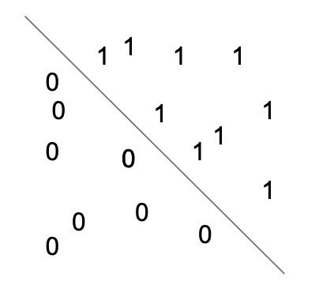
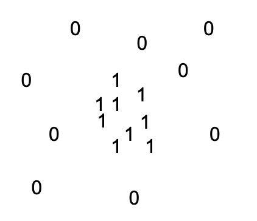

# Classification with logistic regression

We turn now to the task of classification as told from the perspective of the most basic, common, and widely known linear classifier: logistic regression. Let us begin by recalling the classification task:

In this setting, we are given (most likely) noisy and partial access to a function $f: X \to \{0, 1\}$ via a data set $D = \{(x_1, y_1), \dots , (x_n, y_n)\}$ where $y_i$ is a noisy proxy for $f(x_i)$. Our goal is to learn a function that is similar to $f$ on new data.

Similarity is often formalized in the opposite sense (dissimilarity) as a "loss" function. That is, $L(g(x), f(x)) \geq 0$ and $L(g(x), f(x)$ approaches $0$ as $g(x)$ approaches $f(x)$. The learning process to produce $g$ can generally be conceptualized as an optimization process where we seek to minimize $\sum_{x \in D} L(\cdot, f(x))$ over some function space $F$. In the case of logistic regression, we will be using the principle of maximum likelihood to fit our model, so we will actually be maximizing a notion of similarity.

That said, there are many practical concerns that exist when learning models in practice. The goal of this lecture is to introduce the concept of logistic regression formally and develop an intuition for how the model behaves and when it is appropriate. We will then be well suited to gain practical experience fitting our own logistic regression models in the practical portion of today's class.

## What is logistic regression?

The idea with logistic regression is that you will attempt to divide the negative class from the positive class in your data with a codimension 1 hyperplane in your feature space. Let's consider a small example in a 2-dimensional feature space:

Now let's look at another example:

