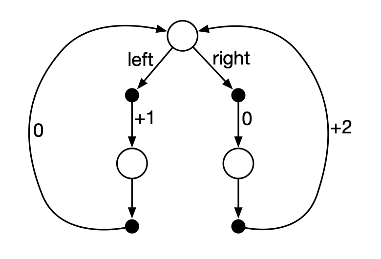
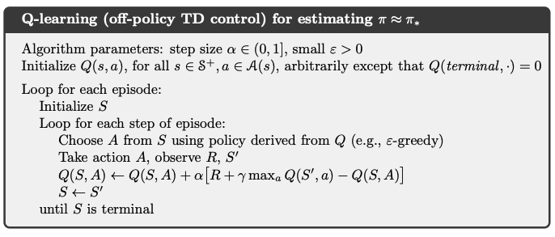

# **RL in Application**

When and how RL approaches can add value in your applications.

https://github.com/jtenini/rl_tutorial

Joe Tenini, PhD
Principal Data Scientist - Red Ventures
Applied Machine Learning - DSBA - UNC Charlotte
Medium - [https://medium.com/@jtenini](https://medium.com/@jtenini)

---

# Agenda

- Why you should care.
- How it works.
- How you should invest.

---

# Why should I care about RL?

- Exciting RL Trophies :trophy: and examples :octopus:
- Comprehensive framework for decision making
- Untapped potential (tooling not commoditized) :robot:

---

# Exciting trophies :trophy:

- [Playing Atari with Deep Reinforcement Learning](https://www.deepmind.com/publications/playing-atari-with-deep-reinforcement-learning) :space_invader:
	- 2013, Deepmind: Mnih, Kavukcuoglu, Silver et al
	- Deep Q-Learning
- State: Pixel values.
- Action: Next button push.
- Reward: Point change.

---

# Exciting trophies :trophy:

- [Mastering the game of Go with deep neural networks and tree search](https://www.nature.com/articles/nature16961) :black_circle: :white_circle:
	- 2016, Deepmind: Silver et al
	- Monte Carlo Tree Search
	- Defeats 18x world champion Lee Sedol
- State: Board position.
- Action: Placing a stone.
- Reward: 1 if winning move, else 0.

---

# Exciting trophies :trophy:

- [OpenAI Five playing Dota 2](https://openai.com/five/) :mage:
	- 2019, OpenAI, Berner et al
	- 10,000 years of gameplay (10 months of real training).
	- Proximal Policy Optimization
	- Defeats world champion _team_ OG.
- State: Partial state observation.
- Action: Mouse and button input.
- Rewards: Shaped rewards.

---

# Exciting trophies :trophy:

Common threads: 
1. As much data as you want (self-play).
2. (Semi)-deterministic environments.

---

# Exciting trophies :trophy:

Common threads: 
1. As much data as you want (self-play).
2. (Semi)-deterministic environments.

Can we still be successful without these?

---

# Examples of RL in practical business application:

Useful simplification 1:

[Bandit problems](https://arxiv.org/search/?query=bandit&searchtype=all&source=header&start=0) (epsiode length 1)

---

# What is the bandit problem?

This happens over and over:
1. You recieve a state $x \in \mathbb{R}^n$ sampled from an unknown static distribution $P(x)$.
2. You choose an action $a \in A$ from a finite set.
3. You recieve a real reward $r \in \mathbb{R}$ sampled from an unknown static distribution $P(r | x, a)$.

Goal: Maximize $\sum r$.

---

# What is the bandit problem?

This happens over and over:
1. You recieve a user represented by $x \in \mathbb{R}^n$.
2. You choose an experience or offer $a \in A$ from a finite set.
3. The user transacts (or doesn't) resulting in revenue $r \in \mathbb{R}$.

Goal: Maximize $\sum r$.

---

# Demo 1 - bandits

---

# Can we do better than epsilon greedy?

Practical advice:
1. It will depend on your environment.
2. For most environments, it's particularly difficult.
3. Often you'll introduce additional parameters that are hard to tune in practice.

---

# Can we do better than epsilon greedy?

[SquareCB](https://arxiv.org/pdf/2002.04926.pdf) is a nice option:

- Instead of choosing each option with probability $1/k\epsilon \dots$
- Choose each option with probability 
$$\frac{1}{\mu + \gamma (q(x,a_{best})-q(x,a))}$$

---

# Interesting bandit complications

1. Debiasing data (wrto actions).
2. Evaluating policies (OPE).
3. Dynamic environments (forgetting).
4. Dynamic actions spaces (new actions).
5. Hyperparameter tuning (simulation).

---

# Some interesting examples

1. Booking talking about their bandit simulation platform. [link](https://arxiv.org/abs/2209.04147)
2. Netflix personalizing title artwork. [link](https://netflixtechblog.com/artwork-personalization-c589f074ad76)
3. Red Ventures talking about MAB. [link](https://medium.com/rv-data/how-to-make-good-decisions-5aabdd997509)

---

# MAB -> CMAB -> ?

---

# Beyond Bandits - MDPs

A Markov Decision Process (MDP) is 4 things:
1. A set of states $S$.
2. For each state $s$, a set of actions $A(s)$.
3. For each state $s$ and action $a$, a distribution on the state space $S$ - $P(s' | s,a)$ [transition probabilities].
4. For each state $s$ and action $a$, a distribution on $\mathbb{R}$ - $P(r | s,a)$ [reward distribution].

---

# What do we do with MDPs?

We design agents!

---

# What is a agent?

For each $s \in S$, a distribution on the available actions $\pi(A(s))$.

By sampling agents, we generate a trajectory - $s_1, a_1, r_1, s_2, \dots$.
We want an agent that maximizes _return_ - $\mathbb{E}(\sum r)$ over the trajectory.

---

# Example MDP

---

# MPD vs Bandit

A bandit problem is an MDP with length 1 trajectories.

- Strategy vs Tactics
- Return vs Reward
- Regret bounds vs PAC bounds

---

# Example business problem - sequential interactions.

Imagine you send a weekly email that can be informational or transactional. Informational emails increase a user's baseline propensity to transact, while transactional emails can give users a momentary boost in propensity to transact, but with a risk that they may unsubscribe.

What type of email do you send each week?
What if these dynamics vary user to user?

--- 

# Demo 2 - MDPs

---

# What are the 80% solutions?

1. Reduce to bandit case (with small policy set).
2. Tabular Q-Learning.
3. Q-learning with function approximation.

--- 

# What is Q-Learning?

Q-learning centers around learning and leveraging a "Q function" - $Q_{\pi}(x, a)$, which estimates the expected return of being in state $x$, taking action $a$, and then following policy $\pi$ thereafter. Put sloppily, $Q_{\pi}(x, a) = \mathbb{E}(\sum r | x, a, \pi)$.

---

# What is Q-Learning?

Q-learning gives us a way to learn $Q'$ - the Q-function associated to an optimal policy. With this in hand, we can behave (mostly) greedily on $Q'$. That is, choose your action to be: $\hat{a} = \arg \max_a Q'(x, a)$.

---

# What is Q-Learning?

---

# Can we do it with function approximation?

Idea: Yes, use gradient descent instead of a tabular update:
- Take action $a$.
- Recieve next state $s'$ and reward $r$.
- Update model parameter $\theta$ in the direction of:

$-\nabla_{\theta}(Q(s, a) - r - \max_{a'}Q(s',a'))^2$

---

# Do people actually do this?

1. YouTube using (slate-level) Q-Learning. [link](https://arxiv.org/pdf/1905.12767.pdf)
2. TaoBao building an MDP twin of its ecommerce site. [link](https://arxiv.org/pdf/1805.10000.pdf)
3. Building educational games that keep users engaged. [link](http://grail.cs.washington.edu/projects/ordering/orderingpaperExtended.pdf)

---

# Thank you very much!

---
